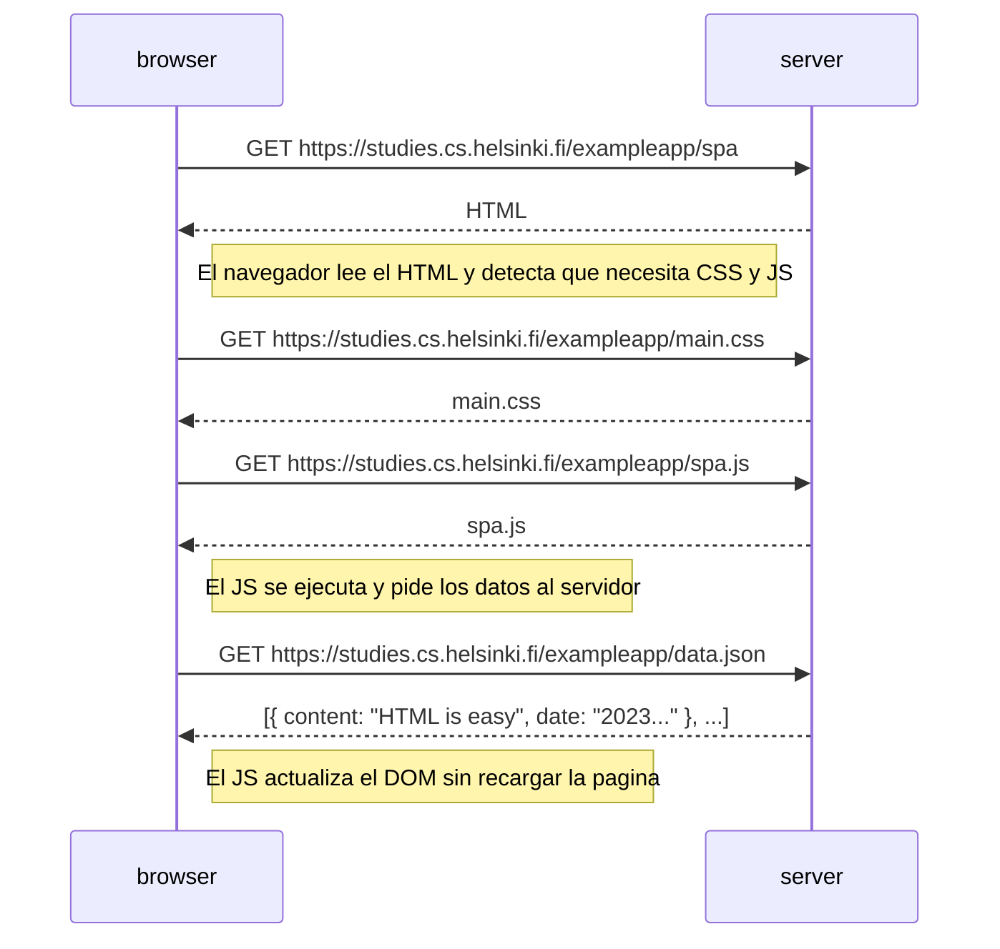

# 0.5 Diagrama SPA

```mermaid
sequenceDiagram
    participant browser
    participant server

    browser->>server: GET https://studies.cs.helsinki.fi/exampleapp/spa
    server-->>browser: HTML

    Note right of browser: El navegador lee el HTML y detecta que necesita CSS y JS

    browser->>server: GET https://studies.cs.helsinki.fi/exampleapp/main.css
    server-->>browser: main.css

    browser->>server: GET https://studies.cs.helsinki.fi/exampleapp/spa.js
    server-->>browser: spa.js

    Note right of browser: El JS se ejecuta y pide los datos al servidor

    browser->>server: GET https://studies.cs.helsinki.fi/exampleapp/data.json
    server-->>browser: [{ content: "HTML is easy", date: "2023..." }, ...]

    Note right of browser: El JS actualiza el DOM sin recargar la pagina
```
