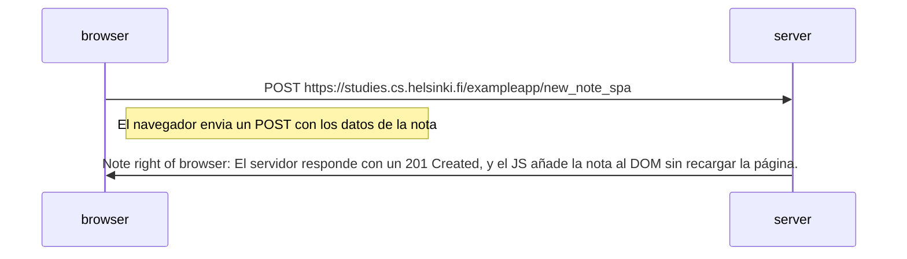

#0.6 Crear una nota nueva en la SPA

```mermaid
sequenceDiagram
    participant browser
    participant server

    browser->>server: POST  https://studies.cs.helsinki.fi/exampleapp/new_note_spa
    Note right of browser: El navegador envia un POST con los datos de la nota

    server->>browser: Note right of browser: El servidor responde con un 201 Created, y el JS añade la nota al DOM sin recargar la página.

```
